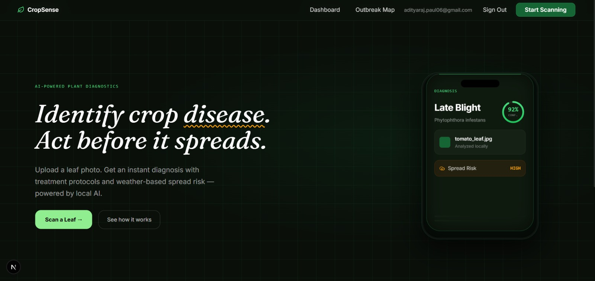
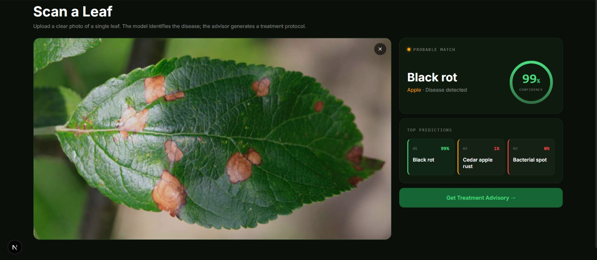
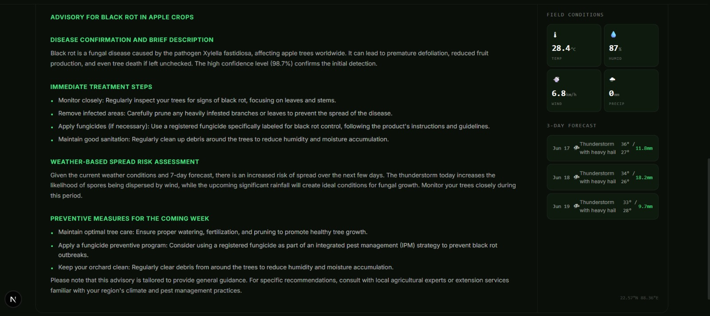
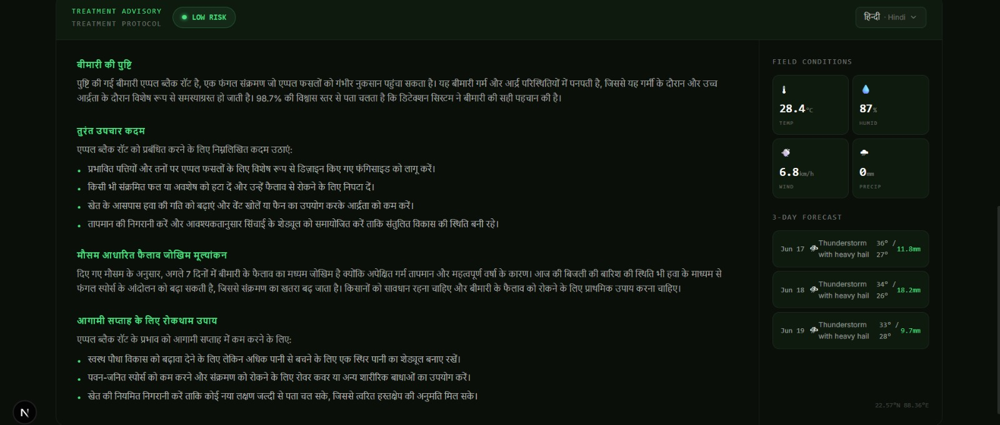
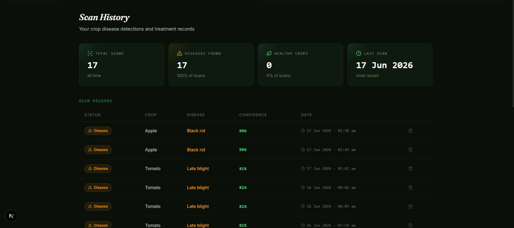
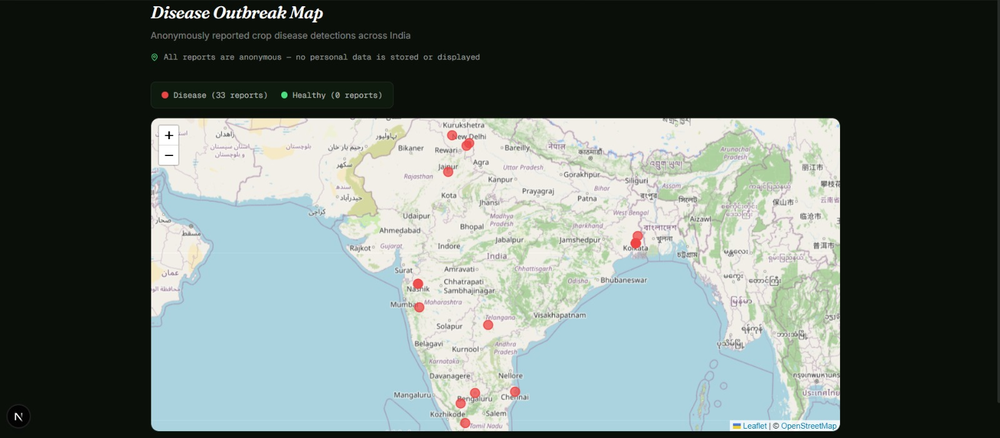

# CropSense — AI Crop Disease Advisor

<div align="center">

**Upload a leaf photo → get an instant disease diagnosis and AI-generated treatment protocol.**

[](https://nextjs.org/)
[](https://fastapi.tiangolo.com/)
[](https://tensorflow.org/)
[](https://supabase.com/)

</div>

---

## What it does

1. **Scan** — Upload a crop leaf photo. EfficientNetB3 (fine-tuned on PlantVillage, 38 classes) identifies the disease with confidence scores.
2. **Advise** — LLaMA 3 generates a structured treatment protocol using real-time weather data (Open-Meteo) for spread risk assessment.
3. **Translate** — Switch the advisory to Hindi, Bengali, Telugu, or Tamil on demand. Translations are cached per session.
4. **Map** — A community outbreak map (Leaflet + OpenStreetMap) shows anonymously reported disease detections across India.
5. **History** — Authenticated users can view, track, and delete their scan history.

---

## Screenshots








---

## Tech Stack

| Layer | Stack |
|---|---|
| Frontend | Next.js 15 (App Router), Tailwind CSS v4, Framer Motion, shadcn/ui |
| Backend | FastAPI, TensorFlow 2.16.1, Uvicorn |
| LLM | LLaMA 3 via Ollama (local) · Groq API (fallback + translation) |
| Weather | Open-Meteo API (free, no key required) |
| Auth + DB | Supabase (PostgreSQL + RLS + Auth) |
| Map | Leaflet.js + OpenStreetMap |

---

## Architecture

```
Browser → Next.js (port 3000)
            └── /api/* proxy routes (server-side only)
                    └── FastAPI (port 8000)
                            ├── EfficientNetB3 inference
                            ├── LLaMA 3 advisory generation
                            ├── Open-Meteo weather fetch
                            └── Groq translation

Supabase
  ├── scans             — per-user scan history (RLS protected)
  └── outbreak_reports  — anonymous disease locations (public read)
```

The browser never calls FastAPI directly — all backend communication goes through Next.js server-side API routes. This keeps the backend URL and service role key off the client.

---

## Local Setup

### Prerequisites
- Python 3.11+, Node.js 22+
- [Ollama](https://ollama.com) installed locally
- Supabase project (free tier)
- Groq API key (free at [console.groq.com](https://console.groq.com))

### Backend
```bash
cd backend
python -m venv venv
venv\Scripts\activate        # Windows
pip install -r requirements.txt
ollama pull llama3.2:3b
```

Create `backend/.env`:
```env
LLM_PROVIDER=ollama
OLLAMA_BASE_URL=http://localhost:11434
OLLAMA_MODEL=llama3.2:3b
GROQ_API_KEY=your_key_here
GROQ_MODEL=llama-3.1-8b-instant
ALLOWED_ORIGINS=http://localhost:3000
```

```bash
uvicorn app.main:app --reload --host localhost --port 8000
```

### Frontend
```bash
cd frontend
npm install
```

Create `frontend/.env.local`:
```env
NEXT_PUBLIC_SUPABASE_URL=your_supabase_url
NEXT_PUBLIC_SUPABASE_ANON_KEY=your_anon_key
SUPABASE_SERVICE_ROLE_KEY=your_service_role_key
BACKEND_URL=http://localhost:8000
```

```bash
npm run dev
```


---

## ML Model

- **Architecture:** EfficientNetB3 fine-tuned on [PlantVillage](https://www.kaggle.com/datasets/emmarex/plantdisease)
- **Classes:** 38 (14 crop types, healthy + disease variants)
- **Format:** TensorFlow SavedModel (89MB)
- **Input:** 300×300 RGB image → normalized → EfficientNetB3 preprocessing

---

## Deployment Notes

Frontend deploys to **Vercel** with zero config. The backend requires ~500MB RAM for TensorFlow on startup, which exceeds Render's free tier (512MB). Recommended options: Hugging Face Spaces (free, 16GB RAM via Docker) or Railway ($5/month free credits). Set `LLM_PROVIDER=groq` in production since Ollama requires a local server.

---

## What I Learned

First end-to-end ML project. Key takeaways:
- ML inference pipeline design — preprocessing, batching, top-k confidence thresholding
- Model serving patterns — singleton loading, async FastAPI, SavedModel vs ONNX tradeoffs
- LLM prompt engineering for structured advisory output and multilingual translation
- Proxy API pattern in Next.js — keeping backend secrets server-side
- Supabase RLS, two-client pattern (anon vs service role), auth middleware
- Real-world ML deployment constraints — TensorFlow memory footprint, Git LFS, free tier limitations

---


<div align="center">
Built by <a href="https://github.com/Adityaraj-web">Adityaraj Paul</a>
